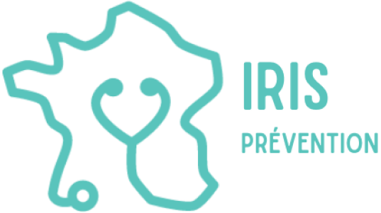

# Test technique Iris Prévention - Laravel

Ce test technique a pour but d'évaluer vos competences sur php et laravel.
Votre capacité à respecter les consignes, à structurer votre code et à gérer vos branches et commits sera aussi évaluée.

## Sujet 1 : Mini-système de blog

### Objectif : Évaluer la capacité à mettre en œuvre un CRUD basique.
- Créer un modèle Post et un modèle Commentaire.
- Valider les inputs avec des formrequests.
- Implémenter une interface :
  - Pour créer et gérer des articles.
  - Pour ajouter des commentaires aux articles.
  - Pour voir les commentaires associés à un article.

#### Bonus : Permettre aux utilisateurs d’aimer un article.

## Sujet 2 : Système d’authentification personnalisé

### Objectif : Tester les compétences en authentification et gestion des sessions.
- Créer un système de connexion/inscription (pas via artisan make:auth).
- Mettre en place :
- Un système de réinitialisation de mot de passe (par email).
- Une protection des routes nécessitant une authentification.
- Obliger les utilisateurs à être connectés pour pouvoir liker et poster des commentaires et des articles.

#### Bonus : 
- #### Implémenter une double authentification (par exemple, un code envoyé par email).
- #### Implémenter un système de rôle, les administrateurs peuvent modérer et modifier les articles des autres utilisateurs.

## Sujet 3 : API REST : Gestion des utilisateurs et des articles

### Objectif : Tester la maîtrise des API et des bonnes pratiques REST.
- Créer une API permettant de gérer des utilisateurs/Articles :
- Créer un utilisateur/Article.
- Récupérer la liste des utilisateurs/Articles.
- Récupérer un utilisateur/article spécifique.
- Mettre à jour un utilisateur/article.
- Supprimer un utilisateur/article.
- Utiliser des Resource pour structurer les réponses.

#### Bonus :
- #### Ajouter une authentification (par exemple, via Passport ou Sanctum).
- #### Implémenter une pagination pour l’API (avec les liens next, prev).

## Sujet Bonus 1 : Événements et Observateurs

### Objectif : Tester la maîtrise des fonctionnalités avancées de Laravel.
- Créer un événement lors de la création d'un article/commentaire et envoyer un email à l'administrateur.
- Créer un événement lors de la suppression d’un article/commentaire et envoyer un email à l’administrateur.
- Créer un événement lorsqu’un utilisateur aime un article et envoyer un email à l’auteur de l’article.
- Mettre en place une écoute pour envoyer un email adéquat à l’utilisateur quand un événement est déclenché.

## Sujet Bonus 2 : Tests automatisés

### Objectif : Évaluer les compétences en TDD ou les tests unitaires.
- Créer des tests unitaires pour valider la logique d’une API REST.
- Les tests unitaires doivent de préférence être écrits avec Pest.
- Proposer un test fonctionnel avec Laravel Dusk (ou autre framework de test type cypress) pour valider l’interface utilisateur du blog.

## Rendu
- Vous devrez fournir un lien vers un dépôt git (GitHub, GitLab, Bitbucket) contenant votre code.
- Vous devrez fournir un fichier README.md expliquant comment installer et utiliser votre application.
- Vous devrez fournir un fichier .env.example pour permettre de configurer l’application.
- Vous devrez fournir des migrations pour la base de données.
- Vous devrez fournir des seeds pour remplir la base de données avec des données de test.
- Votre code doit être exempt de bugs et de vulnérabilités.
- Les bonus ne sont pas obligatoires, mais ils seront appréciés.
- L'utilisation de Docker est un plus.

## Recommandations
- Le répo actuel contient un projet Laravel de base. Vous pouvez le cloner pour commencer le test.
- Vous pouvez utiliser des packages tiers pour faciliter la réalisation du test.
- Vous pouvez utiliser des librairies front-end (Bootstrap, Tailwind, Vue.js, React, etc.) pour améliorer l’interface utilisateur.
- Vous pouvez utiliser des outils de validation de code (Laravel Pint) pour améliorer la qualité de votre code.
- Il est recommandé d'utiliser larastan (phpstan) pour vérifier la qualité de votre code.
- Les commandes stan, pint, et pest sont disponibles dans le projet (composer scripts) pour vous aider à vérifier la qualité de votre code.
- Gérez correctement les erreurs et les exceptions.
- Respectez les conventions de nommage de Laravel.
- Bien organiser vos branches et vos commits.
- N’hésitez pas à ajouter des fonctionnalités supplémentaires si vous le souhaitez.
- N’hésitez pas à poser des questions si vous avez des doutes sur les consignes.
- Bon courage !
